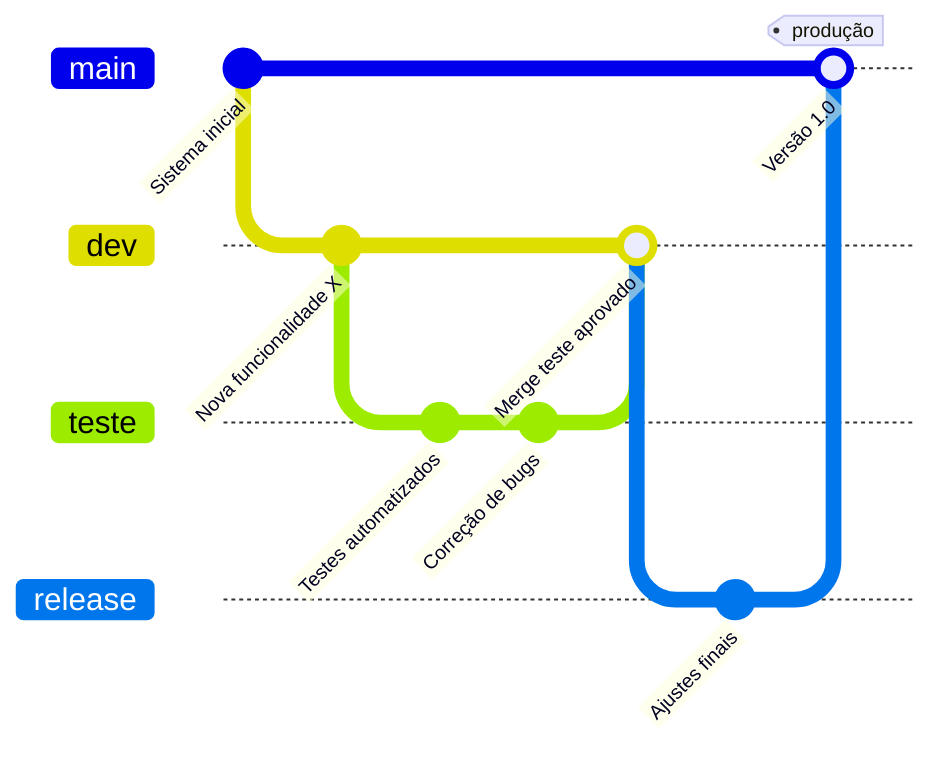

# 📦 Projeto Iris

O projeto Iris visa em ser um projeto em miniatura de uma simualação de uma rede social utilizando React com Flask dentro de um cluster GKE da Google Cloud.

---

## 🚀 Tecnologias Utilizadas

- React / Flask.
- Docker
- GitHub Actions.
- Banco de Dados: PostgreSQL.
- Google Kubernetes Engine (GKE).

---

## 🌱 Fluxo de Branches


---

### ⚙️ Estrutura do Pipeline

Este projeto utiliza **GitHub Actions** para automatizar testes, build e deploy da aplicação em produção. O pipeline está dividido em três jobs principais:

#### 1. `test`
- Executado em pushes para a branch `main`.
- Realiza:
  - Checkout do repositório
  - Configuração do Node.js (versão 18)
  - Instalação das dependências com `npm ci`
  - Execução dos testes com `npm test`

#### 2. `build`
- É disparado após o job `test`.
- Etapas:
  - Configuração do plugin gke-gcloud-auth
  - Autenticação com Google Cloud via secrets
  - Build e push da imagem Docker para o Docker Hub

#### 3. `deploy`
- Build e push da imagem Docker para o Docker Hub
- Deploy no GKE, dependendo da branch:

#### 4. `Release`
- Caso o push vá para a release será enviado um e-mail para notificar sobre a nova versão. 

---

### 💻 Instruções para rodar localmente

**Pré-requisitos:**
- Node.js 18+
- Docker (opcional)
- `.env` com as seguintes variáveis:

```env
VITE_API_URL=http://localhost:3000/api
VITE_ENCRYPTION_KEY=sua-chave-secreta
```

``` 
git clone https://github.com/Party-Chinese-Comunism/frontend-blogpost.git
npm install
npm run dev
```

---

### 🚢 Deploy em Produção

O deploy é feito automaticamente via **GitHub Actions**, conforme definido no arquivo `.github/workflows`.

**Passos:**

1. Realize o **merge** da branch `develop` para `main`.
2. A pipeline será executada automaticamente com as seguintes etapas:
   -  Build da imagem Docker
   -  Push para o Docker Hub
   -  Autenticação com GKE
   -  Atualização do deployment via kubectl
